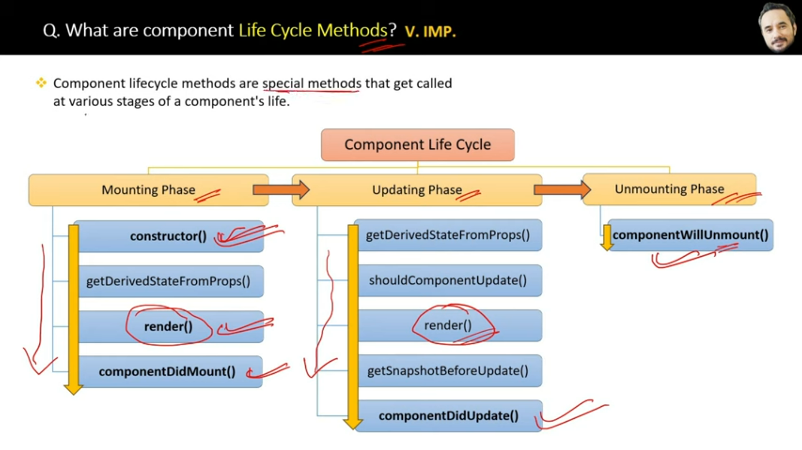
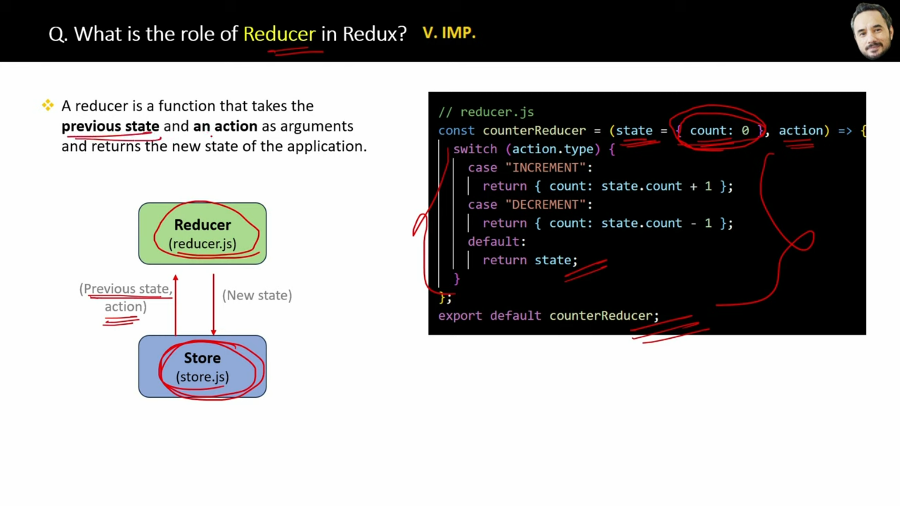

# when to use useContext() hook instead of props in real application

use usecontext() instead of props when you want to avoid prop drilling and access context values directly within deeply nested components. 

## component life cycle methods: 

# component life cycle phases: 
    - Mounting phase ( component creation created): this phase occurs when an instance of a component is being created and inserted into the DOM
    - updating phase (rerender components) : This phase occurs when a component is being rerendered as a result of charges to either its props or state
    - unmounting phase( removal from the DOM): This phase occurs when a component is being removed from the DOM.

## component life cycle methods: 
Component life cycle methods are special methods that get called at various stages of a components life.

# 1. Mounting phase 
    - constructor
    - getDerivedStateFromProps()
    - render()
    - componentDidMount()

# 2. updating phase
    - getDerivedStateFromProps
    - render()
    - shouldComponentUpdate()
    - getSnapshotBeforeUpdate()
    - componentDidUpdate()

# 3. Unmounting Phase
    - componentWillUnmount()

## what are constructors in class componetn? when to use them?

constructor is a special method that is called when an instance of class is created.

constructor is used for initializing the components state or performing any setup that is needed before the component is rendered.

## super keyword in constructor
super keyword is used in the constructor of a class component to call the constructor of the parent class

this is necessary to ensure that the initialization logic of the parent class is executed

## role of render() method in component life cycle

## hooks in react :

# 1. useState : manage state in a functional component 

const[count, setCount] = useState(0);

# 2. useEffect : handles side effects like data fetching, subscriptions, or manual DOM updates

useEffect(() => {
    console.log('Component mounted or updated'):
},[dependency]); 

1. Run Once on Component Mount
useEffect(() => {
  fetchData();
}, []); // Empty dependency array means it runs only once.

2. Run on State or Prop Change

const [count, setCount] = useState(0);

useEffect(() => {
  console.log(`Count changed to ${count}`);
}, [count]); // Runs whenever `count` changes.

3. Cleanup Effect

useEffect(() => {
  const timer = setInterval(() => {
    console.log('Timer running');
  }, 1000);

  return () => {
    clearInterval(timer); // Cleanup the timer when component unmounts.
    console.log('Cleanup on unmount');
  };
}, []);

4. Fetch Data from an API

const [data, setData] = useState([]);

useEffect(() => {
  fetch('https://api.example.com/items')
    .then((response) => response.json())
    .then((data) => setData(data))
    .catch((error) => console.error('Error fetching data:', error));
}, []); // Fetches data once on mount.

5. Subscribing to Events
useEffect(() => {
  const handleResize = () => console.log('Window resized');
  
  window.addEventListener('resize', handleResize);
  
  return () => {
    window.removeEventListener('resize', handleResize); // Cleanup on unmount.
  };
}, []);

6. Synchronizing with External Systems

const [count, setCount] = useState(0);

useEffect(() => {
  document.title = `Count: ${count}`;
}, [count]); // Updates title whenever `count` changes.

7. Conditional Execution
const [shouldLog, setShouldLog] = useState(false);

useEffect(() => {
  if (shouldLog) {
    console.log('Effect runs because shouldLog is true');
  }
}, [shouldLog]); // Runs only when `shouldLog` changes.

8. Debounce Effect

const [searchTerm, setSearchTerm] = useState('');
const [debouncedTerm, setDebouncedTerm] = useState('');

useEffect(() => {
  const handler = setTimeout(() => {
    setDebouncedTerm(searchTerm);
  }, 300); // Wait for 300ms after the user stops typing.

  return () => {
    clearTimeout(handler); // Cleanup previous timeout.
  };
}, [searchTerm]);

9. Polling Data Periodically

useEffect(() => {
  const interval = setInterval(() => {
    console.log('Fetching data...');
  }, 5000);

  return () => clearInterval(interval); // Cleanup on unmount.
}, []);

10. Avoiding Infinite Loops

const [count, setCount] = useState(0);

useEffect(() => {
  console.log('Effect ran');
  setCount((prev) => prev + 1); // Don't use `count` here directly to avoid infinite loop.
}, []); // No dependency or specific dependency array prevents loops.

# 3. useContext : Accesses context values without context.consumer

const value = useContext(MyContext);

# 4. useReducer : manage complex static logic using a reducer function(like redux)
const[state, dispatch] = useReduer(reducer, initialState);

# 5. useRef : Provides a mutable reference to a DOM element or variable

const inputRef = useRef(null);

# 6. useMemo : Optimize performance by memoizing expensive computations 
const memoizedValue = useMemo(() => computeExpensiveValue(data), [data]);

# 7. useCallback: memozes callback functions to prevent unnecessary re-renders

const memoizedCallback = useCallback(() => {
    doSomething();
}, [dependency]);

# 1. what is react 
  -react is javascript library to building user interfaces, developed by facebook. 
  - it follows component based architecture  and used virtual DOM for efficient rendering

# 2. virtual DOM 
  - Virtual dom is a lightweight copy of real DOM that react uses to minimize direct DOM manipulations, making updates more efficient 

# 3. JSX ( javascript XML)
  - is a syntax extention that allow writing html- like code in javascript

# 4. what are components in react ?
  COmponents are reusable building blocks of reacts. 
  There are 2 types of components 
  1. functional  components (stateless, hooks)
  2. class  components (stateful, this.state)

# 5. what is difference between props and state 

Feature                   props                           state 
mutability            immutable                         mutable
usage           passed from parent to child             managed within the components
updates         can't be modified inside components     can be updated using setState() or hooks

# 6 HOC (Higher Order Components):
- HOC is a function that takes a component as an argument and returns a new component with additional props or functionality.
- HOC is used to reuse code, abstract away complexity, and make code more modular and reusable .
- HOC is often used for authentication, authorization, and caching.

# 7. what is context API in react ?
- Context API is a way to share data between components without passing props down manually or via a  HOC.
- Context API is used to manage global state, share data between components, and make code more modular and reusable .
- Context API is often used for authentication, authorization, and caching.
# 8. what is a hook in react ?
- A hook is a special function that allows functional components to use state and other React features.

Types of hooks:
1. useState: used to add state to functional components .
2. useEffect: used to handle side effects in functional components.
3. useContext: used to access context in functional components.
4. useReducer: used to manage state in functional components.
5. useCallback: used to memoize callback functions in functional components.
6. useMemo: used to memoize values in functional components.

# 9. what is a reducer in react ?
- A reducer is a function that takes the current state and an action, and returns a new state .
- A reducer is used to manage state in functional components using the useReducer hook.
- A reducer is often used for complex state management, such as managing multiple state variables or handling asynchronous

# 10. what is a saga in react ?
- A saga is a function that handles side effects in a Redux application .
- A saga is used to handle asynchronous operations, such as API calls, in a Redux application.
- A saga is often used for complex state management, such as managing multiple state variables or handling asynchronous

# 11. what is a middleware in react ?
- A middleware is a function that sits between the action and the reducer in a Redux application .
- A middleware is used to handle side effects, such as API calls, in a Redux application.

# 12. what is a thunk in react ?
- A thunk is a function that returns a function, often used to handle asynchronous operations in a Redux
application.
- A thunk is used to handle side effects, such as API calls, in a Redux application.

# 13. what is a store in react ?
- A store is an object that holds the entire state of a Redux application .
- A store is used to manage state in a Redux application.

# 14. what is a dispatch in react ?
- A dispatch is a function that sends an action to the reducer in a Redux application .
- A dispatch is used to update the state in a Redux application.

# 8. what is a controlled component in react ?
- A controlled component is a component whose state is controlled by the parent component .
- A controlled component is used to manage user input, such as text input, forms, in a React application

# 9. what is an uncontrolled component in react ?
- An uncontrolled component is a component whose state is not controlled by the parent component .
- An uncontrolled component is used to manage user input, such as text input, in a React application

# 10. what is a pure component in react ?
- A pure component is a component that always returns the same output given the same props .
- A pure component is used to optimize performance in a React application.

# 11. what is a memoized component in react ?
- A memoized component is a component that is memoized, meaning its props are compared and if they are the same, the component is not re-rendered .
- A memoized component is used to optimize performance in a React application.

# 12. what is a higher order component in react ?
- A higher order component is a function that takes a component as an argument and returns a new component .
- A higher order component is used to wrap a component with additional functionality, such as authentication or caching

# 13. what is a context in react ?
- A context is a way to share data between components without passing props down manually.
- A context is used to manage global state in a React application.

# 14. what is a provider in react ?
- A provider is a component that provides a context to its children.
- A provider is used to manage global state in a React application.

# 15 explain redux in react ?
- Redux is a state management library for React applications.
- Redux helps to manage global state by providing a single source of truth for the state of the application
- Redux uses the concept of actions, reducers, and stores to manage state.  
- Redux is used to manage complex state in a React application.

# 16 how to use redux in react ?
- First, install the redux library using npm or yarn
- Then, create a store using the createStore function from the redux library
- Next, create actions using the createAction function from the redux library
- After that, create a reducer using the combineReducers function from the redux library
- Finally, connect the store to the React application using the connect function from the react-redux library
- Redux is used to manage complex state in a React application.

# 17 is browser usnderstand jsx?
- No, the browser does not understand JSX. JSX is a syntax extension for JavaScript that is used to write HTML-like code in JavaScript files.
- To use JSX in a browser, it must be compiled to JavaScript using a tool like Babel  

# 18. Explain lifting up
- Lifting state up is a pattern where the state of a child component is moved to its parent component,
allowing multiple child components to share the same state.
- Lifting up is a technique used in React to manage state in a component tree.
- It involves moving state up the component tree to a parent component, so that it can be managed
- Lifting up is used to avoid prop drilling, where props are passed down multiple levels in a component tree
- It is used to manage state in a React application.

# 19 purspse of setState 
- The purpose of setState is to update the state of a React component.
- setState is used to update the state of a component in response to user interactions or other events. 
- setState is used to trigger a re-render of the component with the updated state.

# how does react handle prop  drilling  and how to avoid it ?
- Prop drilling is when you pass a prop down multiple levels in a component tree.
- React handles prop drilling by allowing you to lift the state up to a parent component, so that it can be managed there.
- To avoid prop drilling, you can use the following techniques: 
- Lift the state up to a parent component
- Use a context API to share data between components
- Use a library like Redux to manage global state
- Use a library like MobX to manage global state
- Use a library like React Context API to manage global state
- Use a library like React Hooks to manage global state

# lazy loading in react ?
- Lazy loading is a technique used in React to load components or modules only when they are needed.
- It is used to improve the performance of a React application by reducing the amount of code that needs to be loaded initially.
- Lazy loading is used to load components or modules on demand, rather than loading them all at once .

# how does react handles forms 
- React handles forms by using the controlled component pattern.
- In this pattern, the component's state is used to keep track of the form data, and
the component's props are used to update the state.   
- React also provides a number of built-in components and APIs for handling forms, such as the `useState` hook and the `useForm` hook.

# what are lifecycle methods in class components ?
- Lifecycle methods are methods in a class component that are called at different points in a component's lif ecyle.
- They are used to perform tasks such as setting up and tearing down a component's state, and handling events such as mounting and unmounting.  
- Lifecycle methods include methods such as `componentDidMount`, `componentDidUpdate`, and `componentUnmount`.

# how to handle errors in react ?

# Explain the Redux flow (Action → Reducer → Store → View).
- Redux follows a unidirectional data flow. The core idea is that the state of an application is kept in a single store, and the only way to modify it is by dispatching actions that describe what should change.
- The flow is as follows:
  - An action is dispatched from a component .
  - The action is then passed to the reducer.
  - The reducer then updates the state of the store based on the action.
  - The updated state is then passed to the view, which is then re-rendered with the new
state.

1️⃣ View (User Interaction)
     ⬇️ dispatch(action)
2️⃣ Action (Describes what happens)
     ⬇️ sent to reducer
3️⃣ Reducer (Returns new state)
     ⬇️ updates store
4️⃣ Store (Holds the state)
     ⬇️ UI re-renders
5️⃣ View (Updated UI)

# When to Use Redux?
- When multiple components need shared state.
- When the application state is complex and needs predictable management.
- When debugging and testing state changes is important.

MQTT ( message queuing telemetry transport ) is a lightweight messaging protocol that is used for IoT (Internet of Things) applications.

# tesing in react
- Jest is a popular testing framework for React applications.
- Jest provides a lot of features out of the box, including code coverage, snapshot testing, and mocking.

# What are different types of testing in React?
- Unit testing: Testing individual components or functions.
- Integration testing: Testing how multiple components work together.
- End-to-end testing: Testing the entire application from start to finish.
- Snapshot testing: Testing the visual representation of a component.
- UI testing: Testing the user interface of a component.

# What is the difference between fetch() and Axios?
- `fetch()` is a built-in JavaScript function that allows you to make HTTP requests.
- Axios is a third-party library that provides a simple and intuitive way to make HTTP requests.
- Axios is often used in React applications because it provides a lot of features out of the box,such as automatic JSON data parsing and error handling.
- Axios is also often used in conjunction with Redux to handle state changes in the application.

# what is server side and client side rendering?
- Server-side rendering (SSR) is a technique where the server generates the initial HTML of a web page and sends it to the client's web browser.
- Client-side rendering (CSR) is a technique where the client's web browser generates the HTML of a web page.
- SSR is often used in React applications because it provides a lot of benefits, such as improved SEO and faster page loads.
- CSR is often used in React applications because it provides a lot of benefits, such as improved user experience and faster development time.

# javascript and react default is a client side rendering but react also support server side rendering using Next.js

# optimization performace: 
- lazy loading
- code splitting
- memoization
- caching :  
- tree shaking
- minification
- useMemo and useCallback
- React.memo

# differnce between useContext and useReducer
- useContext is used to share state between components using a context API.
- useReducer is used to manage state changes in a component using a reducer function.
- useContext is often used in conjunction with React Context API to share state between components. 
- useReducer is often used in conjunction with Redux to manage state changes in the application.

# difference between useReducer and Redux
- useReducer is a built-in React hook that allows you to manage state changes in a component using
a reducer function.
- Redux is a third-party library that provides a centralized state management system for React applications.
- useReducer is often used in conjunction with React Context API to manage state changes in a component.
- Redux is often used in conjunction with React to manage state changes in the application.

# difference between useMemo and useCallback
- useMemo is used to memoize a value that depends on one or more props.
- useCallback is used to memoize a function that depends on one or more props.
- useMemo is often used to memoize values that are expensive to compute.
- useCallback is often used to memoize functions that are expensive to compute.

# what is error boundries
- Error boundaries are React components that catch and handle JavaScript errors that occur anywhere in their child components tre .
- Error boundaries are a feature of React that allows you to catch and handle errors in a centralized way .

# scalable react application
- use a state management library like Redux or MobX
- use a routing library like React Router
- use a library like React Query to handle data fetching and caching
- use a library like React Helmet to handle SEO
- use a library like React Loadable to handle code splitting

# #######################################################

https://github.com/sudheerj/reactjs-interview-questions
https://www.geeksforgeeks.org/react-interview-questions/
https://www.interviewbit.com/react-interview-questions/

For react
1. Difference between functional and class component
2. Explain hooks
3. HOC
4. Pure component
5. Lifecycle methods of React
6. Real vs virtual dom difference
7. Stateful vs stateless component
8. Context API
9. Redux, redux middleware
10. Routing in React

Top React Js interview questions to prepare From The video:

1) Hooks: Prepare this in order

- useState
- useEffect
- useContext
- useReducer
- useMemo
- useCallback
- useRef

2) Higher Order Components (HOC):

- What?
- When?
- Why?
- How?

3) Life Cycle Methods of Components:

- Class Components
- Mounting
- Updating
- Unmounting

4) State management (all about data):

- State/Props
- Props drilling
- Context

5) Redux or Zustand:

- How redux works?
- Why?
- When?
- Redux Toolkit (RTK)

6) Custom Hooks:

- When to use?
- Code
- Why? (to make code clean, maintainable, readable, reusable)

7) Lazy Loading (Very imp and highly asked):

- Code splitting
- Chunking
- Suspense

8) Virtual DOM:

- Reconciliation Algorithm
- React Fiber
- Renders
- Diff algorithm
- How does render work?

9) SSR vs CSR (important) :

- What?
- Difference
- SEO and performance (SSR)

10) Routing (Role-based access control-RBAC)

- react-router
- How do you manage protected routes?
- How do you handle routes?
- query params
- Dynamic routing

11) Testing

- React Testing Library
- Unit Testing

Hack for interview: Try to mention that the code you wrote is testable and try to write test cases.

12) Async Tasks

- API Calls
- useEffect in depth
- Events
- Promises
- setTimeout

13) Reusability, Readability, modularity, testability (Coding Practices)

14) Performance 

- Lazy loading
- Asset optimization (how do you optimize js, css code)
- Writing optimized code
- Bundler
- CDN / Server level
- Rendering of components

15) Styling

- Tailwind
- StyleX
- Bootstrap
- Material UI
- Ant UI
- CSS / SCSS

16) Accessibility

17) Security

What are error boundaries?
What is the use of useEffect React Hook?
redux and its usage

## javascript
 Closures
 Execution Context and Scope
 Asynchronous JavaScript
 Promises, async/await, callbacks
 Higher-Order Functions - map, filter, reduce
Event Delegation
Hoisting
Spread and Rest Operators
Execution Context, Call Stack, and Memory Heap

## react 
Component Lifecycle Methods (Class Components)
State and Props
Hooks 
redux
React Router
React State Management
Handling Forms
Performance Optimization
Code Splitting and Lazy Loading
Error Boundaries
 React Context API
 React Refs
 Keys in React
Immutable State
Shallow Rendering

# #################################### Happpy interview questions ###########################################################

# what is react 
- developed by facebook in 2013
- react is open source javascript library .
- react used for building user interfaces (UI)
- react simplifies the creation of SPA by using reusable components 

# advantages 
- simple to build single page application(by using components)
- react is cross platform and open source(free to use)
- react is lightweight and very fast due to virtual DOM
- Large community and ecosystem 
- Testing is easy 

# disadvantages 
- not  a good choice for small application

# SPA ( Single page applications )
- A single page applications is a web applications have only one single web page 
- whenever user do some action on the website, then in response content is dynamically updated without refreshing or loading new page

# React and Angular
- React and angular both are used to create single page UI applications using components.
React - 
  - react is javascript library
  - react uses virtual DOM which makes it faster
  - react is smaller in size and lightweight and therefore faster sometime
  - react depends on external libraries for many complex feature, so developer has to write many lines of code for complex functionalities.
  - react is simple to learn and more popular than angular 

Angular - 
  - angular is complete framework 
  - angular uses real DOM 
  - angular is bigger because it is a complete framework 
  - since angular is complete framework, therefore it provide built in support for features like routing, forms, validation and HTTp requests.
  - Angular is slightly difficult to learn as it has typescript, oops concept and many more thing.

# DOM ( Document object model ):
  - DOM represents the web page as a tree-like structure which allows javascript to dynamically access and manipulate the content and structure of a web page. 
 

# difference between DOM and Virual DOM 

| Feature                | DOM (Document Object Model)                           | Virtual DOM                                      |
|------------------------|-------------------------------------------------------|--------------------------------------------------|
| **Definition**         | Tree-like structure representing the actual web page  | Lightweight in-memory copy of the real DOM       |
| **Source**             | Provided by browser                                   | Created and managed by JavaScript frameworks     |
| **Performance**        | Slower for frequent or complex UI updates             | Faster due to optimized diffing and batching     |
| **Update Process**     | Direct updates affect the UI immediately              | Updates are calculated and then applied selectively |
| **Rendering Cost**     | High, as each change triggers re-rendering            | Low, only minimal required changes are applied   |
| **Use in Frameworks**  | Used in traditional JavaScript                        | Used in modern frameworks like React, Vue        |
| **Re-rendering**       | Happens for each DOM change                           | Happens only when diff detects a change          |
| **Efficiency**         | Less efficient for dynamic apps                       | More efficient for dynamic and interactive UIs   |
| **Visibility**         | Visible and accessible via browser dev tools          | Not visible directly; exists in memory           |

- React uses virtual DOM to efficiently update the UI without rerender the entire page, which helps improve performance and make the application more responsive.

# React components : 
  - react component is a reusable building block for creating user interfaces. 

# setup ract project 
  - install node.js 
  - to create app
    cmd : npx create-react-app project-name 
  - to run project 
    cmd : npm start

## chapter 2 - main files and folder structure

# What is npm and role of node_modules folder ? 
  - NPM (node package manager)
  - NPM is used to manage the dependencies for your react project, including the react library itself

# role of public folder 
  - Public folder contains static assets that are served directly to the user's browser, such as images, fonts, and index.html file

# index.html :
  this file in a react project is the entry point to the application 

# role of App.js :
  - App.js is the top/main/root level component in a react application, and it is responsible for rendering all of the other components

# role of function and return inside App.js 
  -   In react, a function is a javascript function that returns a react element 

# Can we have a function without return inside App.js 
    yes 

# role of export default inside App.js
  - It is used to make this App component available for import using "import" statement in other files

# what is role of index.js file, ReactDOM and render method in React
  - ReactDOM : is a javascript library which convert your components( which are written in react syntax) to the actual browser DOM.

  - index.js : is the javascript file which renders all the components and replace the root element of index.html file with the newly rendered root element.

# How react app load and display the components in browser ?
   

##  chapter 3 : JSX

# what is JSX 
  - JSX( Javascript XML) is a syntax extension used by react to write HTML-like code.
  -  JSX is converted to javascript via tools like Babel. 
  Because browsers understand javascript not JSX.

# Key features of react
  - 1. virtual DOM : React utilize a virtual representation of the DOM, allowing efficient updates by minimizing direct manipulation of the actual DOM, resulting 
  - 2. Component based architecture
  - 3. Reusability and composition 
  - 4. JSX( Javascript XML)
  - 5. Declarative syntax
  - 6. community & ecosystem
  - 7. React hooks 

# advantages of JSX : 
  - improve code readabilty and writability 
  - error checking in advance 
  - support javascript expressions
  - improved performance 
  - code reusability

# can browser read JSX file ? what is babel?
- No, browser will not understand the JSX code directly
- Babel : in react is used to transpile JSX syntax into regular javascript which browser can understand.
- babel is transpiler

# What is transpiler 
  - A transpiler is a tool that convert source code from one programming language to another

# is it possible to use JSX without react ?
  - yes, it's possible to use JSX without React by creating your own transpiler like babel 
  - However, this is not recommended since JSX is tightly integrated with react and relies on many react-specific features. 

# role of fragment in react (<></>)
  -  in a react, a fragment is a way to group a list of children without adding extra nodes to the DOM.

# How do you iterate over a list in JSX? What is map() method?
  -  map() method allows you to iterate ovar an array and modify its elements using a callback function

# what are spread operator?
  - the spread operator(...) is used to expand or spread an array or object.

# what are the types of conditional rendering in JSX ?
  - if else 
  - ternary operator
  - && operator 
  - switch statements 

# What is difference between declarative and imperative syntax

1. Declarative syntax : 
  - Declarative syntax focuses on describing the desired result without specifying the step-by-step process
  - JSX in react is used to write declarative syntax

2. Imperative syntax : 
  - Imperative syntax involves step by step process to achieve a particular goal.
  - Javascript has an imperative syntax.

# Arrow function expression in JSX :
    arrow function expression syntax is a consise way of defining function.

# main files in a react project : 
  1. index.html : single page for react application
  2. components/component.js : your application components 
  3. App.js : main components or container or root components
  4. App.text.js : used for writing tests for the App.js file
  5. index.css(optional): This is a global CSS file that serves as the main stylesheet for entire application
  6. index.js : Entry point for javascript. Renders the main React component(App) into the root DOM element.    

# HOw react app load and display the components in browser

# library : 
  Developers import the libraries at the top and then used its function in components

# framework : 
  Developers need to follow a specific structure or pattern defined by the framework

# how react provides reusability and composition 
  - react provides reusability and composition through its component-based-architecture
  - Reusability : Once you create a component, you can re-use it in different parts of your application or even in multiple projects
  - composition : composition is creating new and big components by combinig existing small components. Its advantage is, change to one small component will not impact other components.

  # what are state, stateless, stateful and state management terms ?

  1. state : it is a current data of the component
  2. stateful or state management means, when a user perform some action on UI, then the react application should be able to update and re-render that data or state on the UI.

# what are props in jsx 
  - props(properties) are a way to pass data from parent component to a child component 

  function App(){
    return (
      <>
        <ChildComponent name= "swati" purpose="Interview">
      </>
    )
  }
  
  function ChildComponent(props){
    return 
{props.name}, {props.purpose}

  }

  o/p: swati, Interview

### chapter Components - functional/class

  # React components : 
  - react component is a reusable building block for creating user interfaces.

  elements : 
    1. import the react library
    2. define a functional component
    3. return JSX to describe the component's UI
    4. export the component to make it available for use in other files

# what are types of react components? what are functional components ?

Types : 
  1. Functional Components 
    - functional components are declared as a javascript function
    - they are stateless component, but with the help of hooks they can now manage state also

  2. Class Components 

# How do you pass data between functional components in  react 
  - Using props : props is a way to pass data between parent component to child component

# what is prop drilling 
  - prop drilling is the process of passing down props through multiple layers of components.

# why to avoid prop drilling? In how many ways can avoid prop drilling?
  why to avoid prop drilling 
    - 1. Maintenance : prop drilling can make code harder to maintain as changes in data flow require updates across multiple components.
    - 2. Complexity : It increases code complexity and reduces code readability
    - 3. Debugging : Debugging becomes challenging when props need to be traced through numerous components.

    # 5 ways to avoid prop drilling
      1. Using context API
      2. Using Redux
      3. Using Component Composition
      4. Using Callback functions
      5. Using Custom hooks

# What are class components in react 
  - class components are defined using Javascript classes
  - They are stateful components by using the lifecycle methods 
  - the render method in a class component is responsible for rendering JSX.    

# HOw to pass data between class component in react
  - this.props can be used in child component to access properties/data passed from parent component 

# role of this keyword in class components 
  -   this keyword is used to refer to the instance of the class

# difference between functional component and class component  

| Feature                      | **Class Components**                                 | **Functional Components**                              |
|-----------------------------|-------------------------------------------------------|--------------------------------------------------------|
| **Syntax**                  | ES6 classes                                           | JavaScript functions (ES6 arrow or regular functions)  |
| **State Management**        | Use `this.state` and `this.setState()`                | Use `useState` hook                                    |
| **Lifecycle Methods**       | Have lifecycle methods like `componentDidMount()`     | Use `useEffect` and other hooks                        |
| **`this` Keyword**          | Required (e.g., `this.props`, `this.state`)           | Not required                                           |
| **Hooks Support**           | Not used                                              | Fully supported (`useState`, `useEffect`, etc.)        |
| **Code Complexity**         | More verbose and complex                              | Cleaner and easier to read                             |
| **Performance**             | Slightly heavier                                      | Generally lighter and faster                           |
| **Best Use Case**           | Legacy code or complex state logic with lifecycle     | Most modern React development                          |
| **Introduced In**           | React since early versions                            | Became powerful with React 16.8 (Hooks)                |
| **Boilerplate Code**        | More (constructor, binding methods, etc.)             | Less (concise and functional)                          |

## Chapter Router 

# What is routing and router in react 
  **Routing** : Routing allows you to create a single page application with navigation, without the need for a full page refresh 

  **REact Router** : react router is a library for handling routing and enables navigation and rendering of different component based on the URL.

# how to implement routing in react 
  - install router 
  cmd : npm install react-router-dom 
  - create navigation 
  - create routes

# What are the roles of <Routes> & <Route> component in react routing 
  - The <Routes> component is used as the root container for declaring your collection of routes 
  - The <Route> component is used to define a route and specify the component that should render when the route matches.

 # WHat are Route parameters in react routing ?
 -  Route parameters in React Router are a way to pass dynamic values(data) to the component as part of the URL path 

 Ex. <Route path="/users/:userId" component={UserProfile}>
 <!-- userId is the route parameter -->

# role of switch component in react routing 
  - Switch component ensures that only the first matching <Route> is rendered and rest are ignored.
    ex. switch is commonly used to handle 404 or "not found" routes.

  Ex. import {Switch, Route} from 'react-router-dom';

  <Switch>
    <Route path="/users" element={<UserList/>}>
    <Route path="/users/:id" element={<UserList/>}>
  </Switch>

# role of exact prop in react routing 
  - exact prop is used with the <Route> component to match exactly to provided path.

## Chapter : Hooks- useState/useEffect

# what are react hooks? what are the top react hooks?
  - React hooks are inbuilt functions provided by react that allow functional components to use state and lifecycle features.
  - Before hooks, class components lifecycle methods were used to maintain state in React applications. 
  - to use react hook first we have to import it from react library

  1. useState : state
  2. useEffect : side effect 
  3. useContext : Context
  4. useReducer : Complex state
  5. useCallback : Memoization
  6. useMemo : Performance
  7. useRef : refs
  8. useLayoutEffect : Synchronous side effects 

#  what is the role of useState() hook and how it works
  - The useState hook enables the functional components to manage state. 
  - useState() working: useState() function accept the initial state value as the parameter and returns an array with two elements:
    1. The first element is the current state value(count in this code)
    2. second element is the function that is used to update the state(setCount in this code)

  - The concept of assign array elements to individual variables is called array destructuring.

  <!-- State is the current state value -->
  <!-- setState is a function that used to update the state -->
  const [state, setState] = useState(initialValue);

# role of useEffect(). HOw it works and what is its use
  - the useEffect hook in react is used to perform side effects in functional components. 

  - For ex. Data fetching from API, subscriptions or any other operation that needs to be performed after the component has been rendered. 

  - 1. useEffect() is called after the component renders. Example, side effects

  - 2. useEffect() function will accept ttwo parameter: (Effect function, dependency array).

# what is dependency array in useEffect() hook ?
  Dependencies arrays act as triggers for useEffect to rerun, meaning if any of dependencies value change, the code inside useEffect() will be executed again.

# empty array[] in useEffect()
  - an empty array[] indicates that the effect function should only `run once`.

## Chapter : Hooks- useContext/useReducer

# role of useContext hook :
  - useContext in react provides a way to pass data from parent to child component without using props

# what is createContext() method? What are provider and consumer properties?
  - createContext() function return an object with provider and consumer properties
  - The provider property is responsible for providing the context value to all its child components.
  - useContext() method or consumer property can be used to consume the context value in child component.

# when to use useContext() hook instead of props in real application
  - Use useContext instead of props when you want to avoid prop drilling and access context values directly within deeply nested components.

### Chapter : Components lifecycle methods - 1

# What are components life cycle phases 
  1. Mounting phase ( Component creation started) 
    - This phase occurs when an instance of a component is being created and inserted into the DOM

  2. Updating phase (Component updates)
    - This phase occurs when a component is being rerendered as a result of changes to either its props or state

  3. Unmounting phase( Removal from the DOM)
    - This phase occurs when a commponent is being removed from the DOM.

  

# What are component life cycle methods?
  - Component lifecycle methods are special methods that get called at various stages of a component life 

  

# What are constructors in class component? When to use them
  - Constructor is a special method that os called when an instance of the class in created
  - Constructor is used for initializing the components state or performing any setup that is needed before the component is rendered.

  

# role of super keyword in constructor
  - Super keyword is used in the constructor of a class component to call the constructor of the parent class
  - This is necessary to ensure that the initialization logic of the parent class is executed.

  # role of render() method in component life cycle 
  
  

  - Render() method returns the react elements that will be rendered to the DOM

# HOw the state can be maintained in a class component? 
  
  - Two step to process to maintain state 
    1. this.setState() method is used to update the state
    2. this.state property is used to render the update state in DOM.

# role of componentDidMount() method in component life cycle 
  
  - componentDidMount() lifecycle method in react is the part of mounting phase and is `called after a component has been rendered` to the DOM.
  - Mostly used for side effects. for ex, external data fetching or setting up subscriptions.

# Chapter : Controlled & Uncontrolled components 

# what are controlled components in react 
  - A controlled components is a component whose form elements(like input fields or checkboxes) are `controlled by the state` of the application.
  

# what are diffences between controlled and uncontrolled components 

# characteristics of controlled components 
1. state control : 
  THe value of the form element is stored in the components state.

2. event handling: 
  Changes to the form element trigger an event(eg. onChange for input fields)

3. state update: 
  The event handler updates the components state with the new value of the form element.

4. Re-rendering : 
  The components re-renders with the updated state, and the form element reflects the new  value.

# advantages of using controlled components in react forms
  - 1. In controlled components, form elements have their values managed by React state, ensuring a single source of truth 

  - 2. This approach facilitates predictable and synchronized updates, making it easier to implement features such as form validation and dynamic rendering and seamless integration with React's lifecycle methods

  - 3. Controlled components offer better control and maintainability compared to uncontrolled components, making them the best practice for handling forms in react applications

# How to handle forms in react 
  - The preffered and recommended approach for handling forms in react is by `using controlled components`.

# How can you handle multiple input fields in a controlled form 
  - Maintain separate state variables for each input field and update them individually using the `onChange event`

    
# how do yuou handle form validations in a controlled components 
  - by using conditional rendering based on the state and validate input values before updating the state.

# In what scenarios might using uncontrolled components be advantageous
  - Uncontrolled components can be beneficial when integrating with non-react libraries, or when dealing with forms where controlled components are not possible

 ## chapter : code splitting 

# code splitting in react : ( imp for performance point of you)
- code splitting is a technique to split the javascript bundle into smaller chunks, which are loaded on demand

# how to implement code splitting 

  1. use React.lazy() to lazily import components
  2. wrap components with Suspense to handle loading 
  3. Configure your build tool(eg. Webpack) for dynamic imports

# what is the role of lazy and suspense methods in react 
  - React.lazy is a function that allows you to load a component lazily 
  - it enables code splittint by allowing you to import a component asynchronously/dynamically, meaning component is loaded when needed only 
  - The suspense component is used to display a fallback UI while the lazily loaded component is being fetched 

# pros and cons of code splitting 
  # pros 
    - faster initial load time 
    - optimized bandwidth usage 
    - improved caching 
    - parallel loading 
    - easier maintenance 

  # cons 
    - complexity 
    - tooling dependencies 
    - potential for runtime errors
    - increase number of requests 
    - learning curve 

# role of import() function in code splitting 
    - The import() function returns a promise that allow dynamic loading of modules 

# puspose of fallback prop in suspense 
  - The fallback prop provides a loading indicator or UI while the dynamically imported component is being loaded 

# Can you dynamically load CSS files using code splitting in react
  - yes, using dynamic import() for CSS files allows you to load styles on-demand along with the corresponding components

# How do you inspect and analyze the generated chunks in a react application
  - use tools like Webpack Bundle analyzer to analyze the size and composition of chunks

## Chapter : others 

# HIgher order component 
  - A higher order component is a component which takes another component as a argument and adds extra features to another component 
  - HOC can be used for providing logging functionality to all the components in a reusable way .

# 5 ways to style react components 
  - inline styles 
  - CSS stylesheets 
  - CSS modules 
  - global stylesheets 
  - CSS frameworks 

# differnce between react and react native 

# graphQL :( developed by facebook )
  - GraphQL is a query language for APIs(Application programming interfaces) and a runtime for executing those queries with your existing data 
  - graphQL and react are often used together. React components can use graphQL queries to fetch the data required for rendering 

# what are the 3 top ways to achieve state management? When to use what in react ? 
  - useState hook 
  - context API
  - Redux
  

# how can you implement authentication in a react application 

# use of react profiler
  - react profiler is a set of tools in react that allows developers to profile(analyze) the performance of a react application 

## differnce between fetch and axios for api calls in react 

# popular testing libraries for react
  - jest 
  - react testing library
  - Enzyme
  - cypress

# How can you optimize performance in a react application 
  - 1. Memoization with useMemo and useCallback
  - 2. Optimizing renders with React.Fragment
  - 3. Lazy loading with React.lazy
  - 4. Code Splitting 
  - 5. Optimizing react_images/images and assets
  

# explain reactive programming with example 
  - Reactive programming is a programming paradigm that focuses on reacting to changes and events in a declarative and asynchronous manner
  - Declarative means a programming style where you write the code for what you want to achieve, rather that specifying step-by-step how to achive it. 
  for ex., jSX in react has declarative syntax
  - Asynchronously means an action that does not block other actions 

# in  how many ways can we implement Reactive programming

# HOw to pass data from child component to parent component in react
  
  - Parent provides a callback function to child and then child component can then invoke this callback to pass data back to the parent.

## Chapter : Redux 
# role of redux 

  - redux is a open source javascript library used for state management 
  - Redux provides a centralized store that holds the entire state of an application and allows components to access and update the state in a predictable manner

# what is the flow of data in react while using redux?
  

# Role of store in react redux ?

  - Redux store enables the application to update state using the defined reducer
  - Redux store is a centralized place for holding the store of all the components in the application

# role of reduxer in redux 
  - 
  - A reduxer is a function that makes the previous state and an action as arguments and returns the new state of the application

#  core principles of redux
  -
  

# What are the differnce between local component state and redux state 
  - 

# What are challenges or dsadvantages while using redux in react ?
  - Boilerplate code 
  - learning curve 
  - verbosity and complexity 
  - Overhead for small projects 
  - global state for local components 
  - Integration with non-react libraries 
  

# What is provider component? How components getting the state from redux store ?

  - Provider component of react-redux will make the `redux store available` to all connected components.

# role of connect funciton in react-redux

  - The connect function is used to make the connection between a react component and the redux store 

# Explain the concept of middleware in react-redux 

  - Middleware provides a mechanism to `add extra functionality` to the redux store 
  - Middleware can intercept actions, modify them, or execute additional logic in actions before they reach the reducers.

## Roadmap of react 
REACT tools including React.js, Webpack, Enzyme, Redux, and Flux